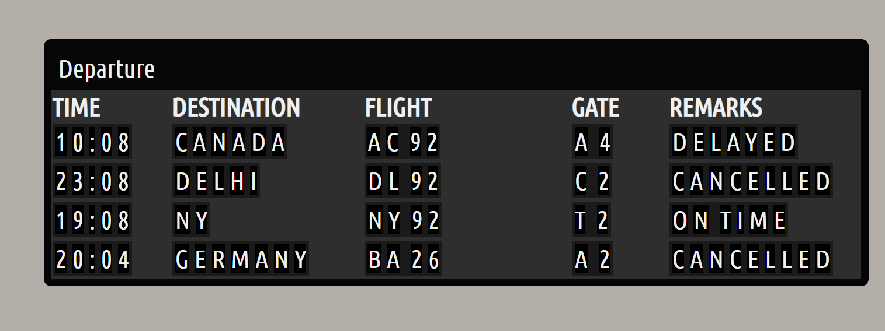

# Flight Widget - JavaScript

Self revising certain concepts of JS as part of #100daysofcoding

## Tech:

> Basic HTML,CSS & JS .

## About:

Flight Widget using JS

> Check out the [Link](https://shijoshaji.github.io/flight-widget_VanilaJS/)

## Screen Shot:

